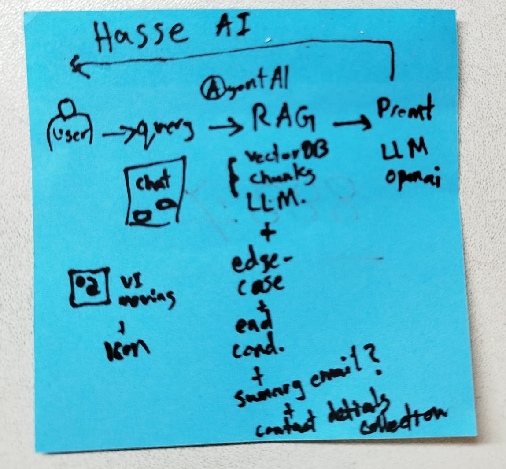

# Swedish Legal AI Widget
## egal-ai-widget

The widget can be embedded into existing law firm websites and provides:

1. AI-powered first-line legal guidance
2. Lead qualification
3. Conversation summarization
4. Consultation request collection
5. Lawyer notification via email
6. Easy integration through a single script tag

The goal is not to replace lawyers, but to automate the initial intake process and help law firms convert website visitors into consultations.
## Live demo
Link available soon

## Features
AI Legal Assistant

Users can ask legal questions in Swedish through a chat interface.

The AI provides:

General legal information
Basic guidance
Clarifying questions
Recommendations for professional legal review when appropriate
Lead Capture

When a user wants further assistance, the widget collects:
```bash
Name
Email
Phone number
Preferred consultation date
Preferred consultation time
AI Conversation Summary
```

Before sending the lead, the AI generates a structured summary including:
```bash
Legal category
User's situation
Key facts
Suggested discussion topics
Lawyer Notification
```
The summary and contact details are automatically sent to the law firm.

## Easy Integration

Add the widget to any website using a single script:
```bash
<script
    src=" https://legal-ai-widget.vercel.app/widget.js"
    data-widget-key="YOUR_WIDGET_KEY">
</script>
Note: Get in contact to get your firm's widget key
```
### Works with:
WordPress
Custom PHP websites
ASP.NET websites
React applications
Most CMS platforms and websites

## Tech Stack
- NextJs
- TypeScript
- Vite
- css
- Resend

## Application Flow Overview
